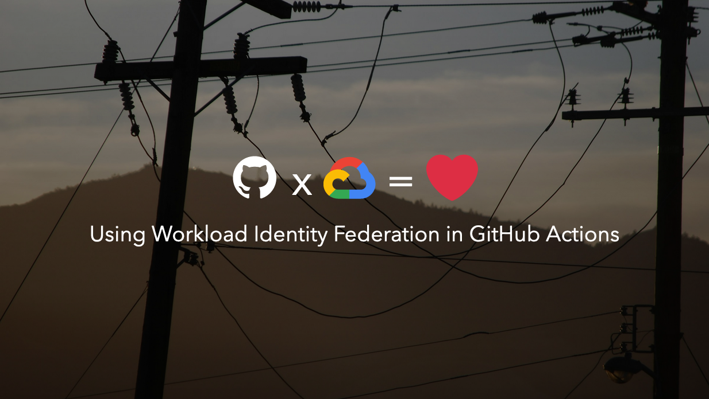

 

You can find the latest version of the slide deck here:

**https://workload-identity-federation-demo-website.storage.googleapis.com/index.html**

## Deployment

This repository doubles as the demonstration of the concepts in the talk.

It contains a [GitHub Actions workflow `.github/workflows/deploy.yml`](.github/workflows/deploy.yml) that builds the slide deck SPA using  [Slidev](https://sli.dev/) (go check it out!) and deploys it to a public Google Cloud Storage bucket.

Authentication between the GitHub Actions runner and Google Cloud is set up using
[Direct Workload Identity Federation](https://github.com/google-github-actions/auth?tab=readme-ov-file#direct-wif).

Yes, deploying the generated page to GitHub Pages would have been simpler, but then I would have to cook up another artificial example for the demo 😉.

## Working on the slides

To start the slide show in dev mode:

- `npm install`
- `npm run dev`
- visit http://localhost:3030

Edit and save [`slides.md`](./slides.md) to see the changes.
